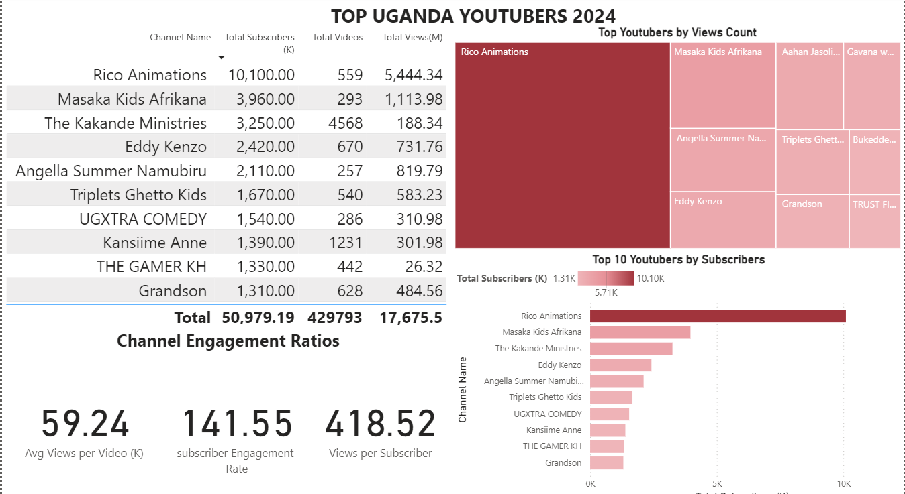

# DATA PORTFOLIO - TOP UGANDAN YOUTUBERS 2024

## Objective
What is the key pain point?
For anyone seeking to find out who the top YouTubers are in 2024 in uganda to decide on which YouTubers would be best to run marketing campaigns throughout the rest of the year.

What is the ideal solution?
To create a dashboard that provides insights into the top Uganda YouTubers in 2024 that includes their

- subscriber count
- total views
- total videos, and
- engagement metrics

This may help in making informed decisions about which YouTubers to collaborate with for their marketing campaigns.

## Data source
What data is needed to achieve our objective?
We need data on the top UG YouTubers in 2024 that includes their

- channel names
- total subscribers
- total views
- total videos uploaded

Where is the data coming from? The data is sourced from Social Blade (an Excel extract), [see here to find it.](https://socialblade.com/youtube/top/country/ug).

### Data Portfolio Disclaimer
The information and visualizations provided in this portfolio are based on historical data and specific time points. While efforts have been made to ensure accuracy, data can evolve over time due to various factors such as system updates, changes in business processes, or external events.

## Visualization - PowerBi Dashboard
### Main Dasboard

### Treemap Showing Top 10 Youtubers by Views Count

### BarChart Showing Top 10 Youtubers by Subscribers

### Data Table

<html lang="en">
<head>
    <!-- Your other head elements (stylesheets, meta tags, etc.) go here -->
</head>
<body>
    <!-- Your main content goes here -->

    <!-- Footer section -->
    <footer>
        

            
Contact me:

            <ul>
                <li>Email: <a href="mailto:kintujp@gmail.com">kintujp@gmail.com</a></li>
                <li>LinkedIn: <a href="linkedin.com/in/john-paul-k-aa6b8757">John Paul Kintu</a></li>
            </ul>
        

    </footer>
</body>
</html>
